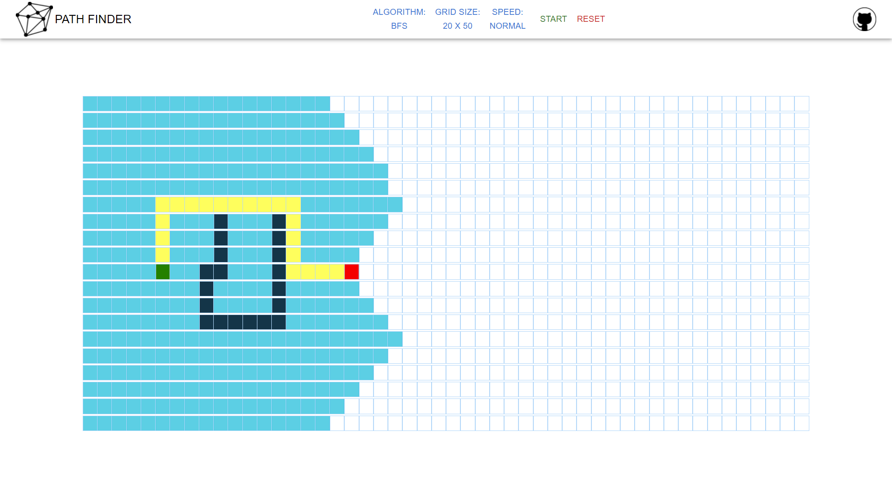

# Path Finder (Path Finding Visualizer)
Visualize path finding algorithms (DFS, BFS, and Dijkstra's). The grid size, animation speed, and walls can be adjusted. 

[Live App - Here](https://jp-sdev.github.io/path_finding_viz/)

Contents
======
- [Path Finder (Path Finding Visualizer)](#path-finder-path-finding-visualizer)
- [Contents](#contents)
  - [Why?](#why)
  - [Tech Used/Prerequisites](#tech-usedprerequisites)
  - [Installation (to run locally)](#installation-to-run-locally)
  - [Features](#features)
    - [Algorithms](#algorithms)
    - [Animation Speed](#animation-speed)
  - [Want to Contribute?](#want-to-contribute)

## Why? 
 - Visualize how the different path finding algorithms arrive to their destination. 
 - Combine my knowledge in algorithms, and React into an interactive app. 

## Tech Used/Prerequisites

 - [NodeJS/npm](https://nodejs.org/en/)
 - [ReactJS](https://reactjs.org/)

## Installation (to run locally)

1.  Clone the repo `$ git clone https://github.com/JP-sDEV/path_finding_viz.git`

2. install dependencies `npm install`

3. Run app locally with `npm start`

## Features

### Algorithms
- Depth First Search (DFS)
- Breadth First Search (BFS)
- Dijkstra's 
  - Code provided by Clément Mihailescu

### Animation Speed
- Toggle between slow, normal, and fast animation speeds

## Want to Contribute?
1. Clone the repo by following [Installation](#Installation)
2. Improve the web-app by:
	- add a feature
	- resolving an issue in the [Issues](https://github.com/JP-sDEV/path_finding_viz/issues) tab
	- refactor code
3. Test the new feature locally
4. Update the Features section in the README.md
5. Open a pull request with a detailed explanation of the changes